## Introduction

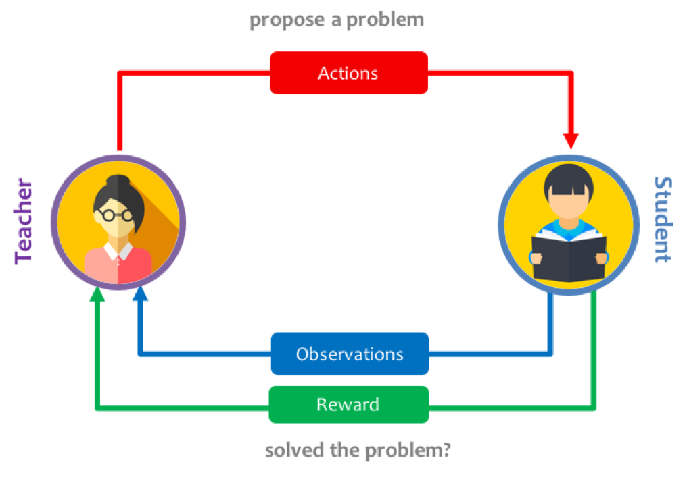
<figcaption>A schematic figure of teacher-student setup. </figcaption>

How would you teach an artificial agent to learn a complex problem, requiring multiple skills but which has very sparse rewards and where you can fail easily?
Humans would tackle this by splitting this hard problem into simpler ones (i.e. creating a *curriculum*), learn them individually, and finally leverage this knowledge to tackle the more complex task.
However, designing this curriculum by hand is time-consuming and very error-prone. Deciding exactly what sub-task to present to an agent and for how long is also underconstrained.

For humans, we would usually rely on teachers to guide our learning by matching the lessons to our competency and increase the difficulty as we learn to master more complex skills.
We can actually do the same in the context of neural networks by introducing a **Teacher** network which learns to generate a curriculum of simpler tasks, so that overall the **student** network can gradually learn to solve the complex task.

In this project, I set out to train an automatic curriculum generator using a teacher network which keeps track of the progress of the student network, and proposes new tasks as a function of how well the student is learning.

This is done in the context of a 2D crafting game, where an agent can learn increasingly complex recipes, to collect resources and treasure while moving around in a 2D gridworld.
I adapted an environment which is fast and efficient to iterate on: [Craft Env](https://github.com/Feryal/craft-env). It supports fully flexible and hierarchical crafting tasks, covering a wide range of difficulty.

I adapted an state-of-the-art distributed reinforcement learning algorithm, for training the student network, while using an adversarial multi-armed bandit algorithm, for the teacher network.
One important aspect of this framework is the choice of the metric for quantifying student progress, and how it affects the curriculum that the teacher learns to propose. I explored some alternatives and will discuss their effects.

Overall, I found that this approach can accelerate learning and interpretability of how the agent is learning to perform complex tasks, and successfully allowed to learn tasks quicker.

---

## Environment

We use a procedural 2D crafting environment, [Craft Env](https://github.com/Feryal/craft-env), adapted from <dt-cite key="2016arXiv161101796A">Andreas et al. 2016</dt-cite>.
It supports a fully flexible setup of hierarchical tasks, with sparse rewards, in a fully procedural setting.

In this environment, an agent has to:
* Move around
* Pick up items and keeping them in an inventory
* Transform things at workshops

Tasks are quite varied, and require to pick up components and create various items.
Here is an example of what is required to perform the task **pick up gold** (see Figure below):

1. Get wood
1. Make plank:  Get wood → Use workbench
1. Make bridge: Get wood → Get iron → Use factory
1. Get gold: Make bridge → Use bridge on water

<figcaption> <b> Crafting environment example for a complex multi-step task.</b>  
When provided with a "get gold" task by the Teacher, the agent needs to first collect wood, transform it at a workshop to construct a bridge, in order to finally pass across the water and reach the gold.  </figcaption>

This kind of multi-step action sequences can be really hard to learn, given that agents usually only perform random exploration.

In total, we have defined a collection of 17 tasks, ranging from simple "collection" tasks to more complex ones that require crafting several items to succeed.
See the next Figure for a complex list, along with an indication of their difficulty.

<figcaption>  <b>Full list of tasks considered in our crafting environment. </b> 
Tasks range from simple collection "Get X" tasks, slightly more difficult crafting tasks (requiring to collect items before), all the way to complex tasks requiring several crafted components which depend themselves on sub-tasks. </figcaption>

We wrote a visualisation tool to see how these environments look like and how agents interact with it.
This is currently only used for post-hoc analysis or debugging, as our agent instead receives a set of features (see next section).
But in future work, we could instead directly use this 2D observation.

<video autoplay muted playsinline loop style="display: block; margin: auto; width: 50%;"><source src="assets/mp4/random_agent.mp4" type="video/mp4"/></video>
<figcaption><b> Visualisation of a random agent trying to solve the "Get grass" task. </b> 
The instruction is shown at the top, the 2D grid in the middle and the inventory is shown at the bottom. Each color correspond to a different object or workshop, the player is the red dot. When the player picks up a green square (grass), the screen flashes to indicate a positive reward.</figcaption>

---

## Problem setup

We use two networks that will interact together (without passing gradients through):

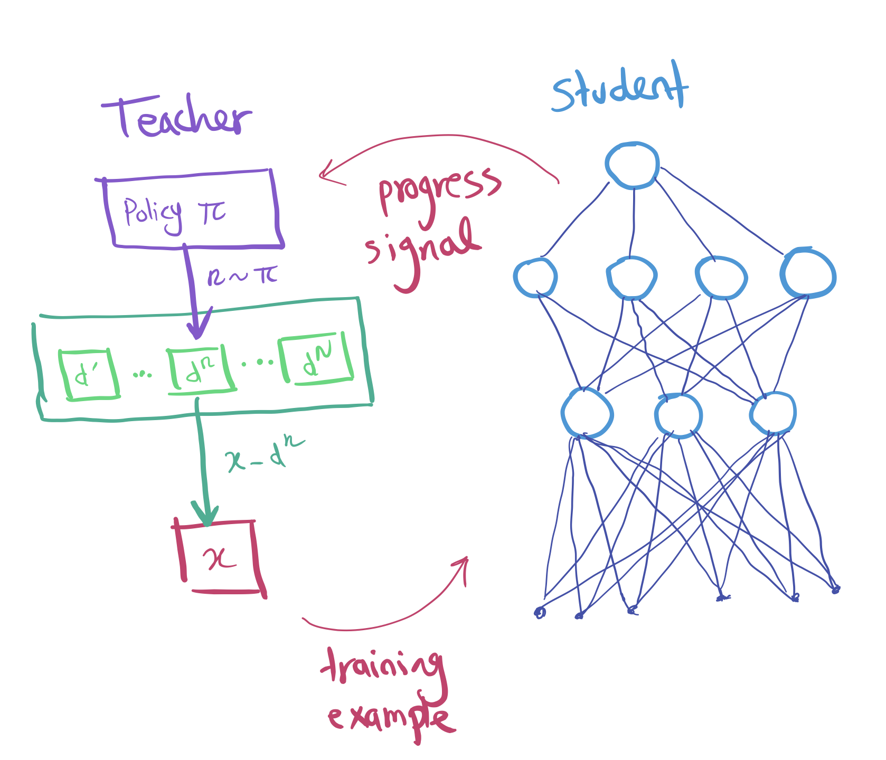
<figcaption>Our Automated Curriculum Learning setup, with both a Teacher and Student networks. </figcaption>

1. **Student network:** receives a task, and is expected to interact in the environment and learn how to solve it.
1. **Teacher network:** proposes tasks by observing the *progress signal* of the student and sampling new tasks that maximise this signal.

We will cover each of these components in turn, let's starts by the Student.

---
### Student

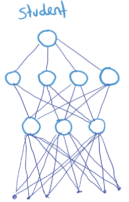

The student can be any classical Deep Reinforcement Learning agent, as from its point of view, it is only expected to solve tasks provided to it. It will be trained end-to-end, using the extrinsic reward function of the task being tackled.

We decided to use <dt-cite key="DBLP:journals/corr/abs-1802-01561">IMPALA </dt-cite>, an efficient and distributed Actor Critic method recently published by DeepMind.
It implements an Advantage Actor Critic method, with an Off-policy *V-Trace* correction. It scales up to use many actors gathering data in a distributed fashion, while a single learning can be run on GPU to a very high throughput.

Additionally, it recently got <dt-cite key="impala_github">open sourced</dt-cite>, which allowed us to use and extend the codebase to our needs.

A schematic of the Actor-Critic loop is shown below. We use 32 actors to gather experience in their own environments, sending their data and observed data back to a centralized queue for the learner to use.

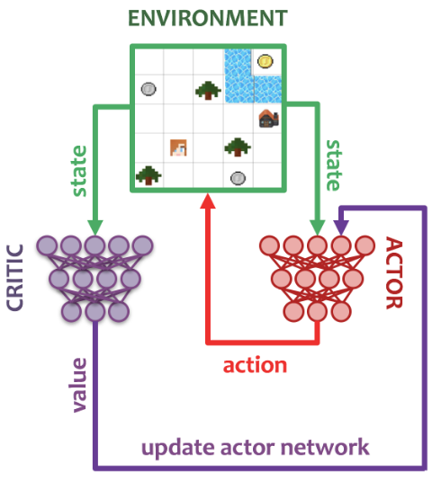
<figcaption>Schematic of Actor-Critic, in the context of our crafting environment. </figcaption>

Our student uses an architecture adapted from IMPALA, consisting overall of a vision module, a language/instruction module, which both send inputs to a recurrent policy core, from which the policy, sampling actions will be extracted (along with a critic predicting the value of the current state).
We replaced the convolutional or ResNet vision module by a fully connected stack.
This is because our observations consist of a flattened vector of features consisting of: 1-hot indicators of the type of element in a given cell, a 5x5 egocentric view around the agent and its inventory.
We provide the current task as a string instruction, which will be embedded by the agent before being processed by a LSTM to handle multiple words.
Details of the architecture can be found in the <a href="#appendix">Appendix</a>.

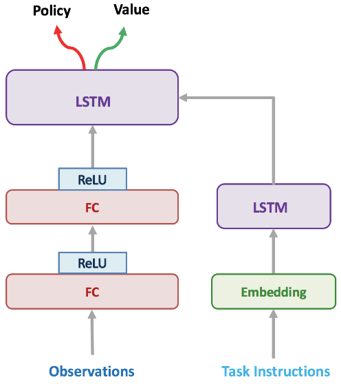
<figcaption>Architecture for the network used by our Student. </figcaption>

In addition, our <dt-cite key="jeju_project_github">implementation of IMPALA</dt-cite> extends the original IMPALA to:
* Handle new Craft Environment, adapted from <dt-cite key="2016arXiv161101796A">Andreas et al, 2016</dt-cite>, procedurally creating gridworld tasks given a set of rules.
* Support “switchable” environments, to change tasks on the fly. This is done fully in-graph in Tensorflow and required to handle the data used by the learner appropriately.
* Evaluation built-in during training, extensive tracking of performance.

---

## Teacher

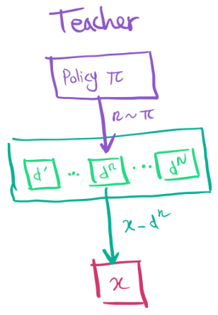

The teacher should be able to follow the student progress, and propose tasks in a sequence which overall should lead to the student solving complex tasks it couldn't before.
It effectively needs to *explore* the space of tasks effectively, as depending on the expertise of the student the same task can be valuable or useless.

<figcaption>A cartoon figure of bandit algorithm! (taken from <dt-cite key="graves2017automated"></dt-cite>). </figcaption>

We decided to use a **Multi-armed bandit** approach for this purpose.
Bandits have been extremely well-studied in the literature and benefit from having optimality proofs for their exploration/exploitation behaviours.
They also have been studied in the context of curriculum design before by <dt-cite key="graves2017automated">Graves et al</dt-cite> which inspired this work.

Multi-armed bandits are related to Reinforcement Learning (see Table below, from <dt-cite key="2015arXiv150803326Z"></dt-cite>), and they actually correspond to a simpler situation where actions don’t affect the world directly.

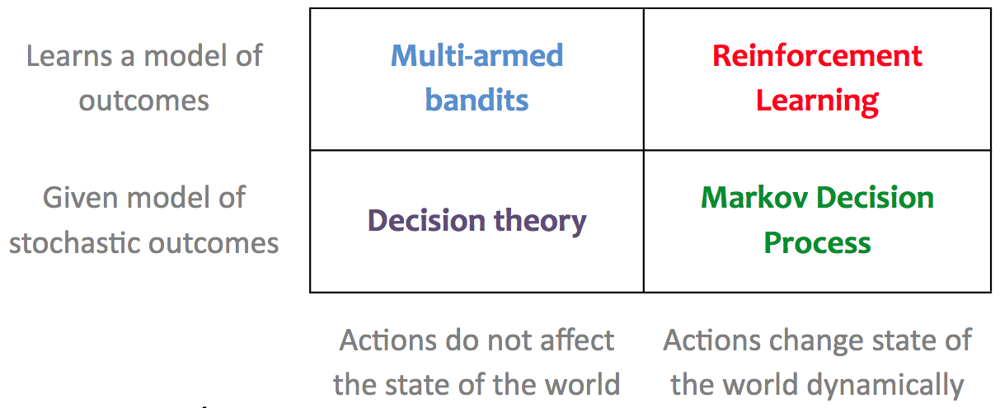
<figcaption>Comparison between Bandit algorithms and Reinforcement learning<dt-cite key="2015arXiv150803326Z"></dt-cite>. </figcaption>

The idea is to have one “arm” per task, and try to find which tasks has the highest reward. In our case, reward really means “student progress”.
Several algorithms exist, all with different behaviours and theoretical properties.

We used a standard algorithm called **"EXP3"**: Exponential-weight algorithm for Exploration and Exploitation <dt-cite key="Auer:2003:NMB:589343.589365"></dt-cite>.
EXP3 optimizes for minimum regret (the expected difference between the sum of the rewards of the policy and an optimal strategy), and can be summarized by the following equations:

$P(\text{pick task } k) = (1 - \gamma) \frac{w_k(t)}{\sum_{i=1}^K w_i(t)} + \frac{\gamma}{K}$

$w_k(t+1) = \begin{cases}
    w_k(t) e^{\gamma \hat{r}(t)/K}  & \text{selected task} \\
    w_k(t) & \text{other tasks}
\end{cases}$

$\hat{r}(t) = \frac{r(t)}{P(\text{pick task } k)}$

If you are interested to learn more about this algorithm, you can find a toy example with code in the <a href="#appendix">Appendix</a>.

### Progress signal

One important design decision for our Teacher is to select what do we mean by the student's **progress signal**.
Indeed, depending on the choices we make to express how a given task has been *useful* to make the student learn, we can make our Teacher behave very differently.

There has been a large variety of signals proposed in the literature to measure the *progress* of learning.
They emphasise different aspects or definition of what *learning* means, varying from assessing performance improvements, to directly looking at changes in the computation being implemented by the student.
<dt-cite key="graves2017automated">Graves et al</dt-cite> studies the progress signals shown in the Table below:

| Progress Signal | $\;\;$ Definition $\;\;$ |
|---|---|
| Prediction gain (PG) | ->$\nu_{PG} := L(x, \theta ) - L(x, \theta')$<- |
|  Gradient prediction gain (GPG) | ->$\nu_{GPG} := \| \nabla L(x, \theta) \|_2^2$<- |
|  Self prediction gain (SPG) | ->$\nu_{SPG} := L(x', \theta) - L(x', \theta') \qquad x' \sim D_k$<- |
| Target prediction gain (TPG)  | ->$\nu_{TPG} := L(x', \theta) - L(x', \theta') \qquad x' \sim D_N$<-  |
| Mean prediction gain (MPG)  | ->  $\;\;\nu_{MPG} := L(x', \theta) - L(x', \theta') \qquad \; x' \sim D_k, k \sim U_N\;\;$<-  |
| Gradient variational complexity gain (GVCG)  | ->$\;\;\nu_{GVCG} := [\nabla_{\phi,\psi} KL(P_{\phi}\|Q_{\psi})]^\top \nabla_{\phi} \mathbb{E}_{\theta \sim P_{\phi}} L(x, \theta)\;\;$<-  |
| L2 gain (L2G) | ->$L_{L2}(x, \theta) = L(x, \theta) + \frac{\alpha}{2} \| \theta \|_2^2$<-  |

In this work, we will study the effect of two particular types of progress signals:
1. **Return gain**: This corresponds to the RL equivalent of "prediction gain" in  the table above. It is a simple signal, which simply measures the increase in return after having trained on a given task.
1. **Gradient prediction gain**: This signal use the sum of gradients of the student as an indicator for the student having “learnt” something. Indeed, given that the student is being trained to optimise its policy, if the policy is optimal (or indeed good enough to get good rewards), there will be nothing to optimize, and hence no gradients applied.

We will compare against using no Teacher, and just randomly choosing a task to train the Student on.
This will be our "random curriculum" baseline.

---

## Results

Here we compare different progress signals, and show how they affect learning progress of the Student.

First, let's see how the **Gradient prediction gain** signal fares to drive our teacher:

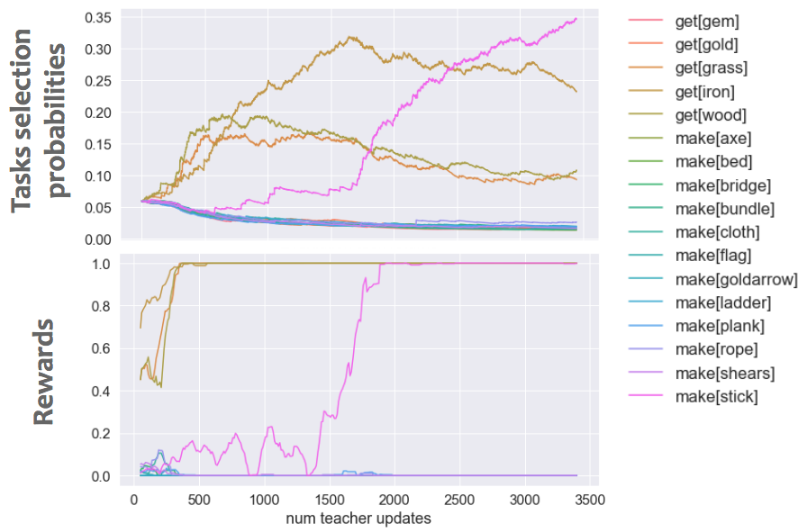
<figcaption><b>Teacher task selection probabilities and student performance for the Gradient prediction gain signal.</b> 
(Top) Teacher task selection probabilities evolution as a functon of teacher updates (i.e. number of tasks shown to the student). (Bottom) Average rewards achieved by the student on all tasks, as the curriculum progresses.
</figcaption>

As shown, some tasks start getting selected early on, after some quick exploration. These actually correspond to simple tasks, and the student quickly learns to solve these tasks well.
Later during training, a medium task is selected (make stick), also allowing this task to be learned by the student.
However, we found that the Gradient prediction gain tends to stick to proposing these simple tasks and does not really expand the curriculum, at least with our current parameters.

We can verify the effectiveness of our automated curriculum by showing the performance of the student at various stages of training, when using different progress signals for our teacher:
<!-- Barplot comparison -->

<!-- Switching buttons -->
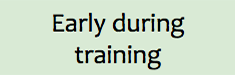
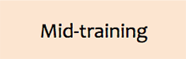
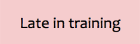

<!-- Barplots -->
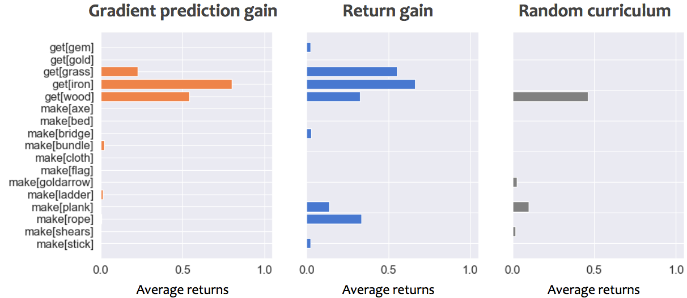

<!-- Preload the other ones but hide them -->
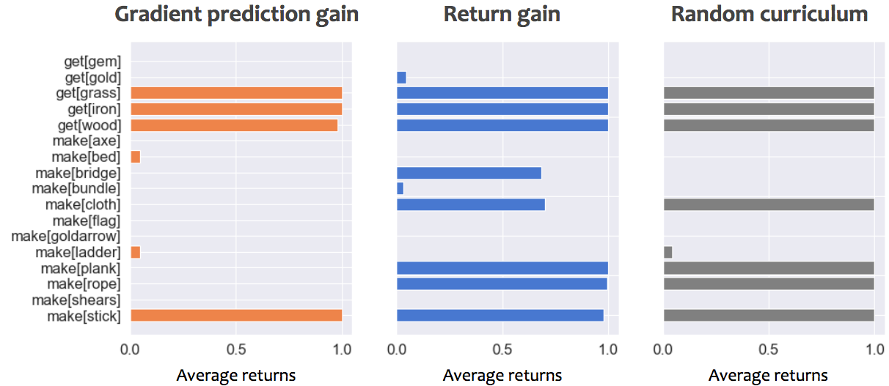
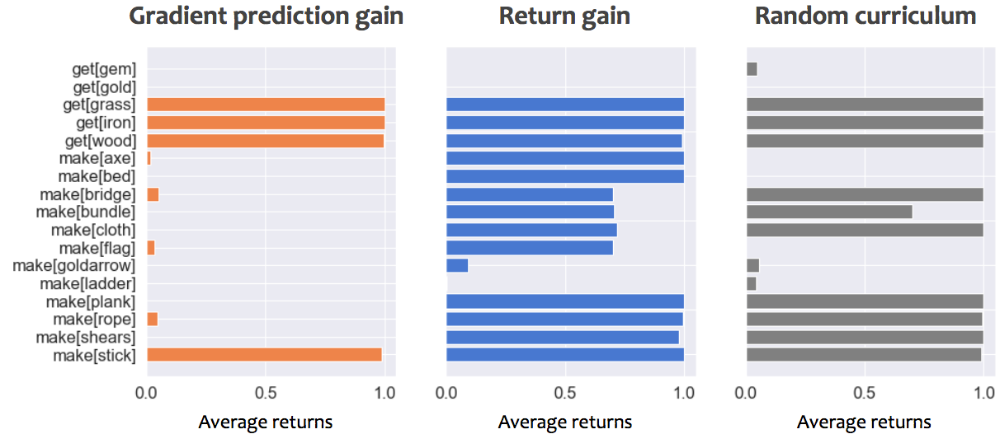
<figcaption style="color:#FF6C00;">Hover on the training stages to see the different barplots at different stages.</figcaption>
<figcaption><b>Comparison of progress signals effectiveness</b> 
Performance of student on all tasks, while using either <b>gradient prediction gain</b>, <b>return gain</b> or a <b>random curriculum</b>. Early during training corresponds to 50,000 steps, Mid-training to 30,000,000 steps and late training 100,000,000 steps.
An average returns of 1 correspond to optimally picking up and craft only what is necessary to solve the task.
</figcaption>

We can compare the performance of our three progress signals at various points during training, to see how they drive the student's performance.

1. Early on both progress signals help the student get off the ground quickly on simple tasks, whereas the random curriculum lost time on proposing tasks that don't match student's capabilities and hence produce no gradients.
2. Midway through training, the gradient prediction gain helped student learn a few tasks well, but is getting stuck proposing similar tasks. The random curriculum is getting better, but the return gain still does better and covers more tasks.
3. Late during training, the Return gain managed to teach many of the tasks, even more complex ones! It’s better than a random curriculum, and please note that we didn’t try to optimize the Teacher parameters much and would be exciting to explore in the future.

Hence, in our current experiments, the **Return gain** performs well, and seems to help the Student learn complex tasks faster.
We can look at its full behaviour through training, by observing the probabilities of selecting different tasks as the curriculum progresses:

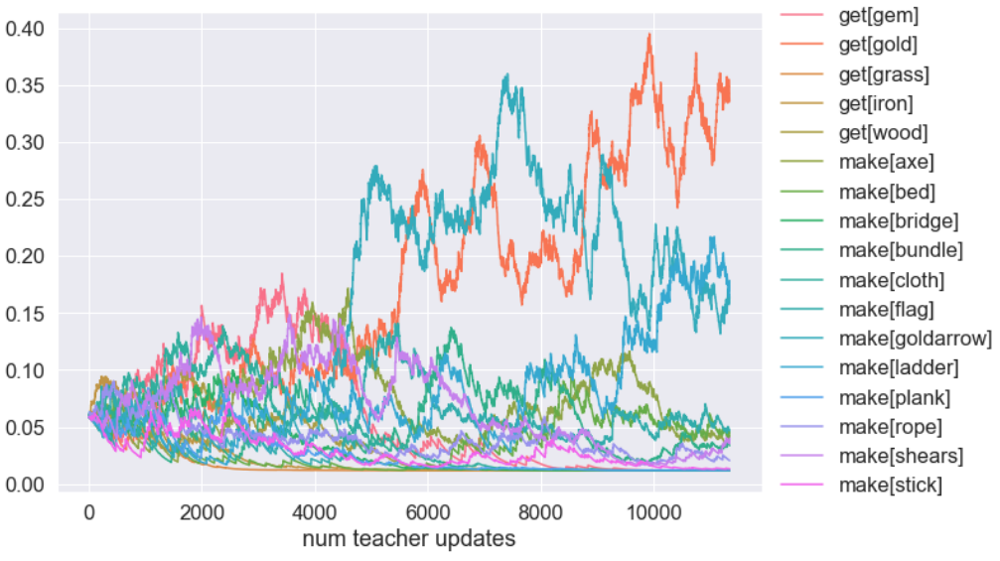
<figcaption><b>Teacher task selection probabilities for the Return gain signal.</b> 
Teacher task selection probabilities evolution as a function of teacher updates (i.e. number of tasks shown to the student).
</figcaption>

This figure is too hard to interpret, but we can improve that, by leveraging the fact that our 17 tasks can be grouped by their *difficulty*.
In this case, we defined difficulty as the *number of steps* required to solve them: simple collection tasks like "get grass" would have difficulty=1, whereas complex tasks like "get gem" would have difficulty=5.
Grouping and renormalising the probabilities of choosing tasks of different difficulties lead to the following curriculum:

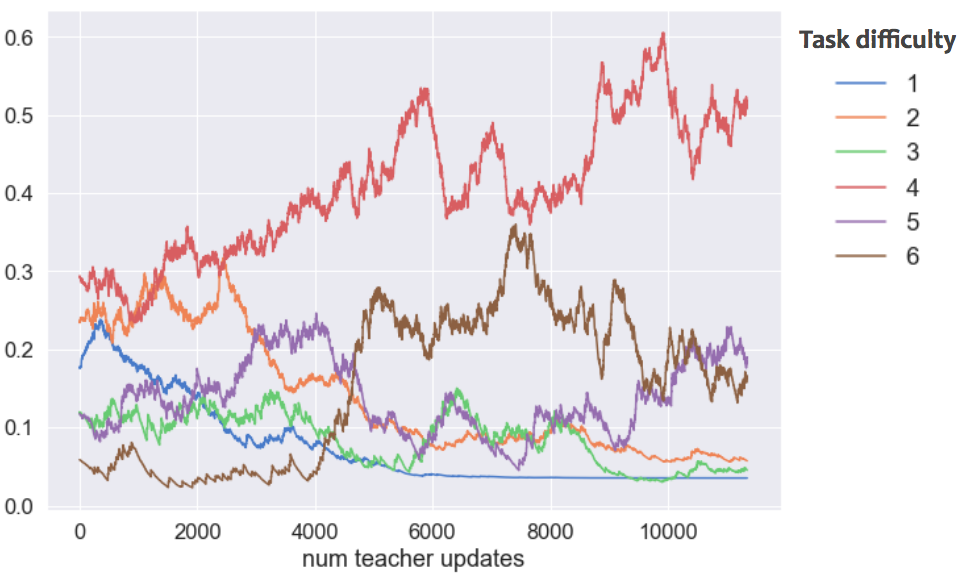
<figcaption><b>Teacher task selection probabilities, grouped by difficulty.</b> 
Grouping (and renormalizing) the tasks by their difficulties, a clear pattern emerges. Simple tasks are selected early on, but are then discarded to let more complex tasks into the curriculum.
</figcaption>

We can see that the Teacher does exactly what we’d like it to do!

1. Early on, it shows simple tasks of length 1, but the agent learns them really quickly. So it stops showing them from 1000 lessons onwards.
2. It switches to slightly more complex tasks, of length 2, and then removes them too after 3000 lessons.
3. For a long time, it shows medium and complicated tasks, because the agent is slowly learning on them.
4. Finally at the end, it starts presenting the hardest tasks we have! It is possible that it also tries to show tasks of difficulty 6 earlier (around 4000 lessons in) but stops when the agent doesn’t progress on them well enough.

Overall, this led to our Teacher implementing some very interesting behaviour, quite compatible with how an optimal curriculum, taking the Student performance into account, should behave.
But we’ll need to do more experiments to see how well it works and if we can optimise parameters to make it even faster.

### Trained Student behaviour

Finally, we can see how our student tackles our tasks, after having followed and learned from an automated curriculum.

<video autoplay muted playsinline loop style="display: block; margin: auto; width: 60%;"><source src="assets/mp4/trained_agent.mp4" type="video/mp4"/></video>
<figcaption><b> Trained agent solving a large set of our crafting tasks.</b> 
Behaviour of a policy learnt by a student when using an automated curriculum to learn all tasks. We show tasks that the agent learnt well (see barplot above). The task instruction is shown at the top, the 2D grid shows the full environment, and the bottom row indicates the agent's inventory.
</figcaption>

This video shows the trained behaviour of a policy on all the tasks that are learnt well. You can see that the agent moves well and picks up what’s needed and transforms them into the correct workshop, successfully crafting complex recipes purely from scratch.

---

## Summary and Future directions

We saw that using an automated curriculum using a Return Gain signal helped our agent solve more complex tasks, where a random curriculum would fail or be too slow.
It led to interesting teaching dynamics, varying the tasks presented to the agent depending on their usefulness to drive learning: it allowed the student to learn incrementally, solve simple tasks and transfer to more complex settings.

We found that using a multi-armed bandit framework for the Teacher to be quite flexible and well adapted to our setting.
But we could improve it to take other signals into account, such as safety requirements (Multi Objective Bandit extension), or using more advanced algorithms to handle the changing student performance.

However, we have to assess the effect of the teacher parameters (it is unclear so far if we could make the gradient prediction gain signal work by forcing it to explore tasks more aggressively), and analyse their interactions with student hyperparameters for learning.
We did not try to explore different Student architectures either, but this would be a very interesting avenue, particularly if we can move away from the feature observations and directly use our generated image observations instead.

It's worth noting that we did not leverage the hierarchical nature of our tasks to make our student more efficient in solving complex tasks.
We could do so by moving towards a Hierarchical RL framework, where we could also leverage the Teacher as a way to propose sequences of sub-tasks to train on, or to learn to compose together.

*This work was started in Jeju Deep Learning Camp 2018 and is meant to be a live research project and will be revised and expanded over time.*

